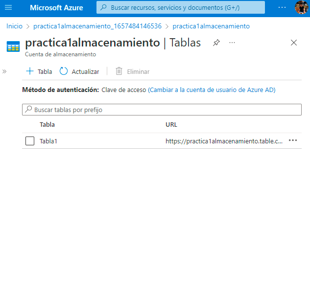
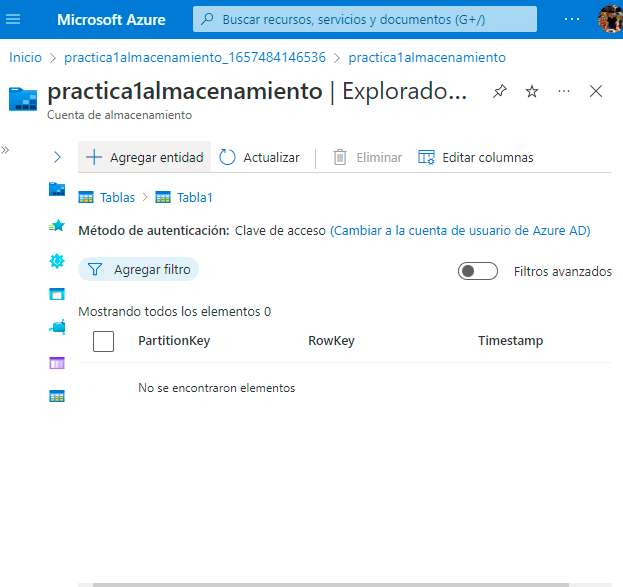
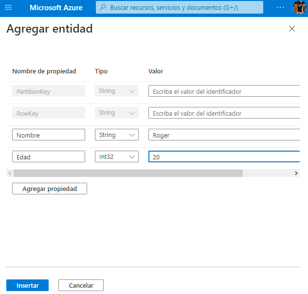

# Practica 4 Sesion 6
Implementación de Azure Tables

- El primer paso es crear un recurso desde el aprtado de tablas.

- Posteriormente entraremos al apartado de agregar entidades.

- Dentro de este apartado podemos crear tablas con sus respectivas propiedades similares a tablas de bases de datos.

---
Autor: Rogelio Clemente Balderas

Fecha: 10/07/2022

Requisitos:
- Azure Storage
- Azure Tables